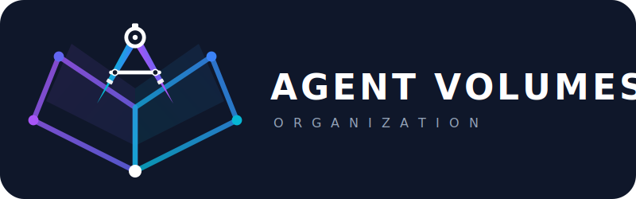

<div align="center">



An open specification for packaging, distributing, and installing components for AI agent runtimes.

[](LICENSE)
[](https://github.com/agent-volumes/agent-volumes-spec/issues)

</div>

## Overview

**Agent Volumes** defines a packaging and distribution standard for the AI agent component ecosystem — analogous to npm for JavaScript, PyPI for Python, or crates.io for Rust — but specialized for **AI agent systems**.

AI agent runtimes — Claude Code, Codex, Gemini CLI, and others — increasingly rely on skills, tools, hooks, and MCP servers. But the ecosystem currently lacks a standard way to package and distribute these components. Runtimes define incompatible layouts, agent components have no shared identity or versioning model, and there is no mechanism for dependency resolution or supply chain verification. Agent Volumes addresses these gaps.

The distribution unit is a **volume**: a versioned package that exports one or more agent components.
Registries that host and serve volumes are called **bibliothecas**.

| Concept | Name | Description |
| ------- | ---- | ----------- |
| Standard | **Agent Volumes** | This specification. |
| Distribution unit | **Volume** | A versioned package of agent components. |
| Package manifest | **volume.toml** | Package-level metadata, like `package.json` or `Cargo.toml`. |
| Registry | **Bibliotheca** | Any registry that hosts and serves volumes. |
| Identity scheme | **pkg:shelf/…** | [purl](https://github.com/package-url/purl-spec)-compatible identifiers for supply chain interoperability. |

This specification is intended for developers building agent runtimes, registries, package managers, and related tooling. End users who consume agent components interact with the standard through client tools such as the `shelf` CLI.

## Component Types

Volumes export six component types:

| Type | Semantics | Invoked by |
| ---- | --------- | ---------- |
| **Agent** | Autonomous agent with system prompt and tool bindings | Runtime |
| **Skill** | Instructional knowledge loaded into agent context | Agent |
| **Command** | User-invoked slash commands | User |
| **Tool** | Function-call endpoints for agent use | Agent |
| **Hook** | Lifecycle event handlers | Runtime events |
| **MCP Server** | Model Context Protocol service endpoints | Runtime / Agent |

## Quick Example

A minimal `volume.toml` declaring three components:

```toml
[volume]
schema = 1
name = "research-agent-pack"
version = "1.4.0"
description = "Research assistant with literature analysis tools"
license = "Apache-2.0"

[publisher]
id = "acme"

[[components]]
type = "skill"
name = "summarize-paper"
entrypoint = "./skills/summarize-paper/SKILL.md"

[[components]]
type = "tool"
name = "arxiv-search"
entrypoint = "./tools/arxiv-search.json"

[[components]]
type = "mcp-server"
name = "research-mcp"
entrypoint = "./mcp/research-server.json"
```

This volume is identified as `pkg:shelf/research-agent-pack@1.4.0`, and individual components are addressable — for example, `pkg:shelf/research-agent-pack@1.4.0#tool/arxiv-search`.

## Specification Contents

The full specification covers:

1. **Introduction** — Purpose, scope, and relationship to existing standards
2. **Package Identity Scheme** — purl-aligned globally unique identifiers
3. **Volume Manifest** — `volume.toml` schema and validation rules
4. **Component Types** — Six types with precise semantics
5. **Component Export System** — Standardized discovery and loading
6. **Cross-Runtime Compatibility Model** — Runtime, protocol, and environment declarations
7. **Content Integrity** — SHA-256 content-hash construction and verification
8. **Trust and Supply Chain Model** — Publisher identity, provenance, permissions, security advisories
9. **Registry API** — HTTP API for conforming bibliothecas
10. **Package Roles** — Component, plugin, provider, and meta roles
11. **Conformance** — Requirements for conforming registries and clients
12. **Design Principles** — Seven guiding principles

**[Read the full specification →](agent-volumes-spec.md)**

## Architecture Decision Records

| ADR | Decision |
| --- | -------- |
| [ADR-0001](decisions/0001-purl-aligned-identity-scheme.md) | Use purl-aligned identity scheme with `shelf` type |
| [ADR-0002](decisions/0002-toml-volume-manifest.md) | Use TOML for volume manifest format |
| [ADR-0003](decisions/0003-six-component-types.md) | Define six component types |
| [ADR-0004](decisions/0004-hybrid-registry-architecture.md) | Use hybrid content delivery architecture for bibliothecas |

## Related Standards

| Standard | Relationship |
| -------- | ------------ |
| [Agent Skills Specification](https://agentskills.io/specification.md) | Component-level manifests (SKILL.md frontmatter) remain compliant. `volume.toml` is a package-level addition. |
| [Package URL (purl)](https://github.com/package-url/purl-spec) | Volume identifiers are purl-compatible via the `shelf` type. |
| [Semantic Versioning 2.0.0](https://semver.org/) | All volume versions follow SemVer. |
| [Model Context Protocol (MCP)](https://modelcontextprotocol.io/) | MCP Server is a first-class component type. |
| [SPDX License List](https://spdx.org/licenses/) | License identifiers use SPDX expressions. |

## Status

This repository contains the **working draft** of the Agent Volumes specification. No stable version has been released yet.

| Document | Version | Status |
| -------- | ------- | ------ |
| [Agent Volumes Specification](agent-volumes-spec.md) | v0.1.0-draft.3 | Working Draft |

| Implementation | Status |
| -------------- | ------ |
| Reference client (`shelf` CLI) | Planned |
| Reference registry (Alexandria) | Planned |

Feedback on the draft is welcome via [GitHub Issues](https://github.com/agent-volumes/agent-volumes-spec/issues).

## Background

Agent Volumes was originally created by [Yunseo Kim](https://github.com/yunseo-kim). The project evolved from [agent-toolbox](https://github.com/yunseo-kim/agent-toolbox), a cross-tool distribution system for AI agent skills targeting Claude Code, OpenCode, Gemini CLI, Cursor, and Codex. The operational experience from building agent-toolbox — including its catalog of 110+ curated skills, cross-tool adapter architecture, and security scanning pipeline — informed the design of the Agent Volumes specification.

The Agent Volumes Organization is an independent, vendor-neutral open standards body stewarding the Agent Volumes specification and ecosystem. Early development and infrastructure were supported by Windlass, which operates the Alexandria reference registry.

## Contributing

Contributions and feedback are welcome. This project is in the draft specification phase — input on specification design is particularly valuable.

## License

This specification is released under the [Apache License 2.0](LICENSE).

Copyright 12026 HE The Agent Volumes Organization and contributors.
